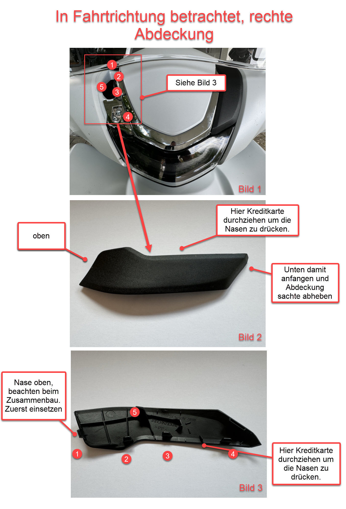
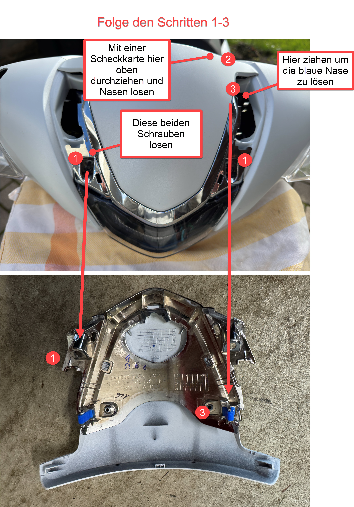
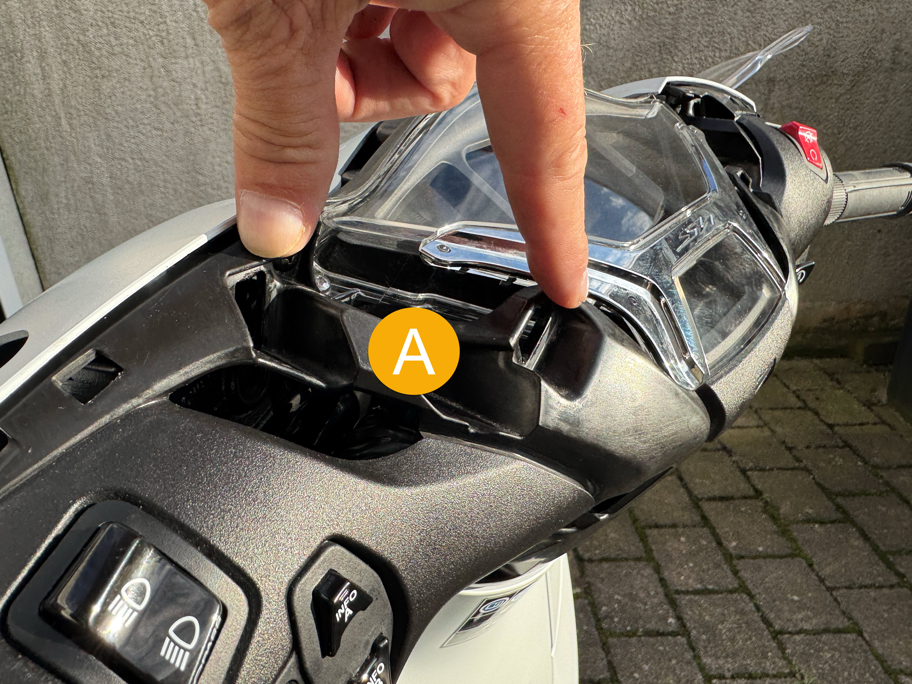
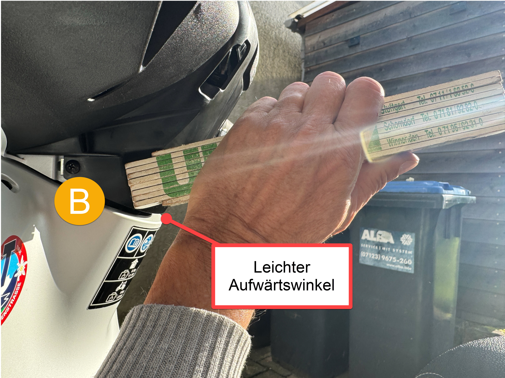
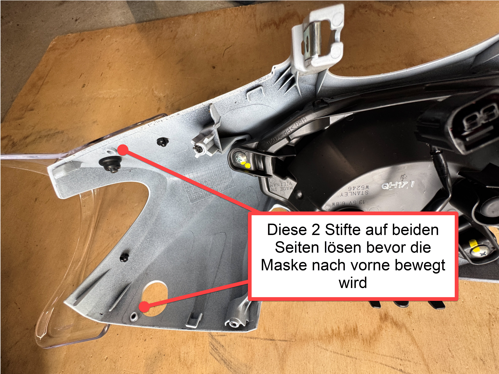
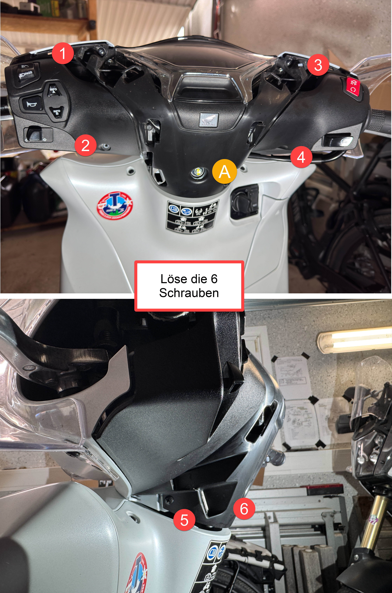
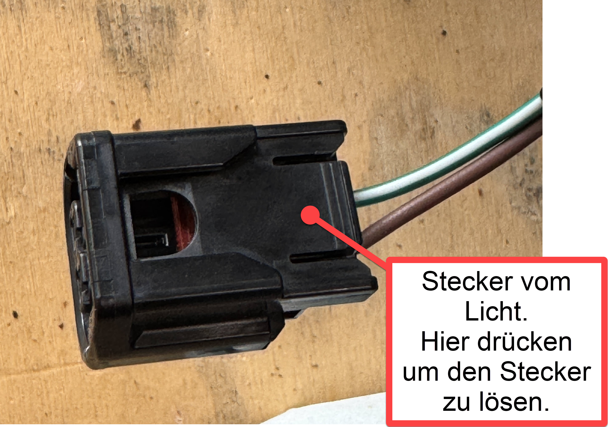

# Abbau der Verkleidungsteile der Lampenmaske. Ziel: Einbau einer Griffheizung an einem Honda Roller SH 350 A NF11

Ich habe mich entschieden eine 
<a href="https://y.hs58.de/z2qoy" target="_blank" rel="noreferrer noopener">Koso Griffheizung</a> an meinem Roller zu verbauen. Warum die Koso? Die Koso hat im Gegensatz zu den meisten anderen den Leistungsschalter direkt im Griff verbaut. Dadurch muss keine Steuerbox montiert und kein Loch in die Verkleidung gebohrt werden wie bei der Original Honda Griffheizung.

Was schnell klar wurde: Die Herausforderung beim Einbau der Griffheizung besteht darin, die Verkleidungsteile so zu demontieren, dass keine Nasen abbrechen. Diese Dokumentation konzentriert sich daher auf den mechanischen und nicht auf den elektrischen Teil.

Die gleichen Informationen benötigst du auch beim Wechsel der Bremsflüssigkeit oder beim Einbau einer Original Honda Bremsscheibe.

Beginnen wir....

<h2>Lenkerendgewichte abbauen</h2>

Die Lenkerendgewichte konnte ich mit einem normalen Kreuzschlitz-Schraubendreher nicht lösen. Mit einem elektrischen Schragschrauber ging es locker.

<h2>Spiegel abbauen</h2>

Die Spiegel müssen weg, sonst können wir die Abdeckungen nicht abbauen. Denke daran, der Spiegel selbst hat ein Linksgewinde, der Sockel dazu ein normales Rechtsgewinde.

<h2>Abdeckungen</h2>

Bevor man beginnt sollte man unbedingt den beweglichen Bereich (Lenker) gegenüber dem statischen Bereich mit einem Tuch abdecken. Herunterfallende Schrauben fallen gerne wie durch einen Trichter von der Lampenmaske zum Kühler und sind nur mit erheblichem Aufwand wiederzubeschaffen.

<h2>Werkstatthandbuch Seite 3-3: Meter Top Cover</h2>

<h2>Werkstatthandbuch Seite 3-19: Handle Cover Garnish</h2>

Dieses Teil kostete mich ziemlich Nerven. Es gibt keine Schrauben, nur Klemmungen.

Klammern (A): Nun zieht man oben beginnend direkt zum Fahrer hin.

Während man die die Klammern (B) in einem leichten Aufwärtswinkel herauszieht.

<h2>Werkstatthandbuch Seite 3-4: Front Handlebar Cover</h2>

Jetzt baut man die komplette Lampenmaske ab.

Nun kann man die Lampenmaske abziehen sowie die Steckverbindung zum Licht trennen:

<h2>Werkstatthandbuch Seite 3-5: Rear Handlebar Cover</h2>

Nun ist es noch angebracht die Instrumententafel zu lösen (nicht abbauen!). Das geschieht mittels zweier Schrauben von vorne und der zentralen Schraube an der Lenksäule, im obigen Bild beschriftet mit <strong>gelbem (A)</strong>.

<h2>Anschluß der Griffheizung</h2>
<ul>
<li>
Vom Anschluß an sich gibt es keine Bilder. In dem Kabelgewirr unterhalb des Instrumentenbereichs befindet sich ein <strong>blauer Stecker mit einer Abdeckkappe</strong>. Dieser Stecker ist die Vorbereitung von Honda für eine Griffheizung. Ich löste die Kontaktstifte aus dem Stecker. Das geht einfach mit einem schmalen Schraubendreher den man von vorne am jeweiligen Anschluß vorbei einführt und hinten am Kabel zieht. 
Nun misst man mit einem Multimeter aus, auf welchem Anschluß sich Plus und welchem Minus befindet (Zündung an machen). Pragmatischerweise lötete ich von der Koso Griffheizung das Anschlußkabel (erheblich gekürzt) direkt auf die Kontaktstifte und isolierte diese anschließend mit Isolierband. 
Raum für die Steuerbox und die überschüssigen Kabel befindet sich ausreichend nahe der Instrumente.
 </li>
<li> 
Die Griffe werden an Stelle der bestehenden Griffe montiert. Um die alten Griffe zu entfernen nutze ich einen langen 5er Inbus. Der lässt sich gut zwischen Griff und Gummi einführen. So kann man den original Gummi unbeschädigt entfernen.
</li>
<li>
Bevor die neuen Griffe montiert werden sollten alte Klebstoffreste mittels Isopropylalkohol entfernt werden.
 </li>
<li>
Achte bei der Montage der neuen Griffe auf genügend Spiel für das Kabel, speziell auf der rechten Seite.
 </li>
<li>
Alle Kabel werden mit Kabelbinder fixiert.
 </li>
</ul>

<h2>Zusammenbau</h2>
<ul>
<li>Teste die Funktionalität der Griffheizung vor dem Zusammenbau! </li>
<li>Teste auch die volle Funktionalität des Rollers. Bei mir waren die Kontakte vom linken Bremsgriffschalter abgerutscht und somit ließ sich der Roller nicht mehr starten! </li>
<li>Beim Anbau der Lenkerendgewichte verwende unbedingt Locktite.</li>
</ul>